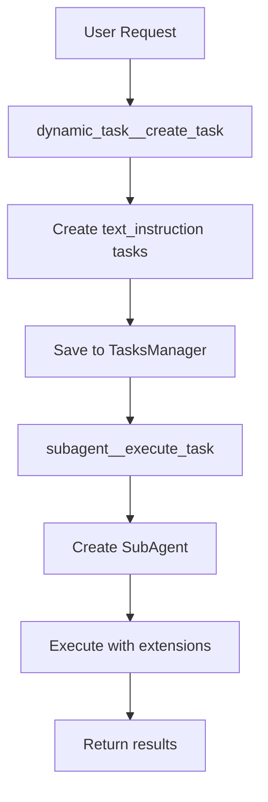
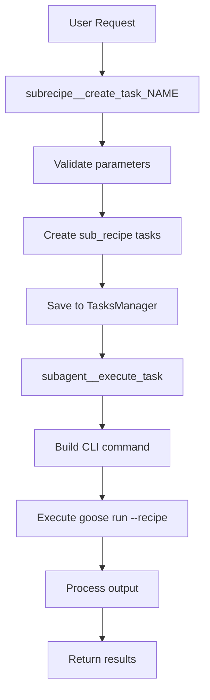

# Deep Dive: Dynamic Tasks vs Subrecipes in Goose

## Executive Summary

After extensive analysis of the Goose codebase, I've discovered that **dynamic tasks and subrecipes represent two distinct approaches to task execution that share significant underlying infrastructure**. Both systems leverage the same subagent execution framework but differ in their configuration, parameterization, and use cases. This report provides a comprehensive analysis of their architecture, implementation details, and potential for unification.

## Table of Contents

1. [Architecture Overview](#architecture-overview)
2. [Dynamic Tasks](#dynamic-tasks)
3. [Subrecipes](#subrecipes)
4. [Shared Infrastructure](#shared-infrastructure)
5. [Key Differences](#key-differences)
6. [Similarities](#similarities)
7. [Design Analysis](#design-analysis)
8. [Implementation Details](#implementation-details)
9. [Unification Possibilities](#unification-possibilities)
10. [Recommendations](#recommendations)

## Architecture Overview

### Core Execution Flow

Both dynamic tasks and subrecipes follow this execution pattern:

```
User Request → Task Creation → Task Manager → Subagent Execution → Result Aggregation
```

The fundamental architecture consists of:

1. **Task Creation Layer**: Different entry points for dynamic tasks vs subrecipes
2. **Task Management Layer**: Shared `TasksManager` for storing and retrieving tasks
3. **Execution Layer**: Common execution infrastructure through subagents
4. **Result Processing Layer**: Unified result handling and aggregation

## Dynamic Tasks

### Purpose
Dynamic tasks are designed for **ad-hoc, text-based instructions** that can be executed without predefined recipes. They're ideal for one-off operations or when the same instruction needs to be run with varying contexts.

### Implementation Details

#### Tool Definition
```rust
// Location: crates/goose/src/agents/recipe_tools/dynamic_task_tools.rs

pub fn create_dynamic_task_tool() -> Tool {
    Tool::new(
        DYNAMIC_TASK_TOOL_NAME_PREFIX.to_string(),
        "Use this tool to create one or more dynamic tasks from a shared text instruction...",
        object!({
            "type": "object",
            "properties": {
                "task_parameters": {
                    "type": "array",
                    "items": {
                        "type": "object",
                        "properties": {
                            "text_instruction": {
                                "type": "string",
                                "description": "The text instruction to execute"
                            },
                        },
                        "required": ["text_instruction"]
                    }
                }
            }
        })
    )
}
```

#### Task Creation Process
```rust
fn create_text_instruction_tasks_from_params(task_params: &[Value]) -> Vec<Task> {
    task_params
        .iter()
        .map(|task_param| {
            let text_instruction = task_param
                .get("text_instruction")
                .and_then(|v| v.as_str())
                .unwrap_or("")
                .to_string();

            Task {
                id: uuid::Uuid::new_v4().to_string(),
                task_type: "text_instruction".to_string(),
                payload: json!({
                    "text_instruction": text_instruction
                }),
            }
        })
        .collect()
}
```

### Key Characteristics
- **Simple parameterization**: Only requires a text instruction
- **No pre-configuration**: Works without recipe files
- **Flexible execution**: Can run any instruction the agent can understand
- **Extension inheritance**: Uses all enabled extensions from the parent agent

## Subrecipes

### Purpose
Subrecipes are designed for **structured, reusable workflows** defined in YAML/JSON files. They support complex parameterization, validation, and can specify their own extensions and configurations.

### Implementation Details

#### Tool Generation
```rust
// Location: crates/goose/src/agents/recipe_tools/sub_recipe_tools.rs

pub fn create_sub_recipe_task_tool(sub_recipe: &SubRecipe) -> Tool {
    let input_schema = get_input_schema(sub_recipe).unwrap();

    Tool::new(
        format!("{}_{}", SUB_RECIPE_TASK_TOOL_NAME_PREFIX, sub_recipe.name),
        format!(
            "Create one or more tasks to run the '{}' sub recipe...",
            sub_recipe.name
        ),
        Arc::new(input_schema.as_object().unwrap().clone())
    )
}
```

#### Task Creation Process
```rust
fn create_tasks_from_params(
    sub_recipe: &SubRecipe,
    command_params: &[std::collections::HashMap<String, String>],
) -> Vec<Task> {
    command_params
        .iter()
        .map(|task_command_param| {
            Task {
                id: uuid::Uuid::new_v4().to_string(),
                task_type: "sub_recipe".to_string(),
                payload: json!({
                    "sub_recipe": {
                        "name": sub_recipe.name.clone(),
                        "command_parameters": task_command_param,
                        "recipe_path": sub_recipe.path.clone(),
                        "sequential_when_repeated": sub_recipe.sequential_when_repeated
                    }
                }),
            }
        })
        .collect()
}
```

### Key Characteristics
- **Structured parameters**: Supports typed parameters with validation
- **Recipe-based**: Requires a recipe file definition
- **Configuration control**: Can specify execution mode, extensions, and settings
- **Parameter inheritance**: Can pass values from parent to child recipes

## Shared Infrastructure

### TasksManager
Both systems use the same `TasksManager` for task storage and retrieval:

```rust
// Location: crates/goose/src/agents/subagent_execution_tool/tasks_manager.rs

pub struct TasksManager {
    tasks: Arc<RwLock<HashMap<String, Task>>>,
}

impl TasksManager {
    pub async fn save_tasks(&self, tasks: Vec<Task>) {
        let mut task_map = self.tasks.write().await;
        for task in tasks {
            task_map.insert(task.id.clone(), task);
        }
    }

    pub async fn get_tasks(&self, task_ids: &[String]) -> Result<Vec<Task>, String> {
        let task_map = self.tasks.read().await;
        // ... retrieval logic
    }
}
```

### Execution Engine
Both use the same execution infrastructure:

```rust
// Location: crates/goose/src/agents/subagent_execution_tool/executor/mod.rs

pub async fn execute_single_task(
    task: &Task,
    notifier: mpsc::Sender<ServerNotification>,
    task_config: TaskConfig,
    cancellation_token: Option<CancellationToken>,
) -> ExecutionResponse {
    // Common execution logic for both task types
}

pub async fn execute_tasks_in_parallel(
    tasks: Vec<Task>,
    notifier: Sender<ServerNotification>,
    task_config: TaskConfig,
    cancellation_token: Option<CancellationToken>,
) -> ExecutionResponse {
    // Parallel execution for multiple tasks
}
```

### Task Processing
The actual task processing differentiates between types:

```rust
// Location: crates/goose/src/agents/subagent_execution_tool/tasks.rs

async fn get_task_result(
    task: Task,
    task_execution_tracker: Arc<TaskExecutionTracker>,
    task_config: TaskConfig,
    cancellation_token: CancellationToken,
) -> Result<Value, String> {
    if task.task_type == "text_instruction" {
        // Handle dynamic tasks using subagent system
        handle_text_instruction_task(task, ...)
    } else {
        // Handle sub_recipe tasks using command execution
        let (command, output_identifier) = build_command(&task)?;
        // ... execute goose CLI command
    }
}
```

## Key Differences

| Aspect | Dynamic Tasks | Subrecipes |
|--------|--------------|------------|
| **Definition** | Inline text instructions | YAML/JSON recipe files |
| **Parameters** | Simple text string | Typed, validated parameters |
| **Execution Method** | Direct subagent invocation | CLI command execution |
| **Extension Control** | Inherits all enabled extensions | Can specify custom extensions |
| **Reusability** | Ad-hoc, one-time use | Designed for reuse |
| **Validation** | None | Parameter validation, JSON schema |
| **Configuration** | Minimal | Full recipe configuration |
| **Sequential Control** | Auto-determined | `sequential_when_repeated` flag |

## Similarities

1. **Common Task Structure**: Both create `Task` objects with unique IDs
2. **Shared Execution Pipeline**: Same executor infrastructure
3. **Parallel/Sequential Support**: Both can run in parallel or sequential mode
4. **Result Aggregation**: Same result processing and error handling
5. **Progress Tracking**: Same `TaskExecutionTracker` for monitoring
6. **Cancellation Support**: Both support cancellation tokens
7. **Notification System**: Same notification infrastructure

## Design Analysis

### Strengths of Current Design

1. **Separation of Concerns**: Clear distinction between ad-hoc and structured tasks
2. **Flexibility**: Different execution methods for different needs
3. **Reusability**: Shared infrastructure reduces code duplication
4. **Extensibility**: Easy to add new task types

### Weaknesses

1. **Code Duplication**: Similar patterns in task creation
2. **Execution Divergence**: Different execution paths (subagent vs CLI)
3. **Feature Disparity**: Subrecipes have more features (validation, schema)
4. **Complexity**: Two systems to maintain and understand

## Implementation Details

### Dynamic Task Execution Flow



### Subrecipe Execution Flow



## Unification Possibilities

### Option 1: Unified Task Type with Mode Flag

```rust
enum TaskMode {
    TextInstruction,
    Recipe { path: String, params: HashMap<String, Value> }
}

struct UnifiedTask {
    id: String,
    mode: TaskMode,
    extensions: Option<Vec<ExtensionConfig>>,
    validation: Option<JsonSchema>,
}
```

### Option 2: Dynamic Tasks as Inline Recipes

Convert dynamic tasks to inline recipe definitions:

```yaml
# Generated inline recipe for dynamic task
version: 1.0.0
title: Dynamic Task
description: Auto-generated from text instruction
instructions: "{{ text_instruction }}"
extensions: [] # Inherit from parent
```

### Option 3: Recipe Templates for Dynamic Tasks

Create a template system where dynamic tasks use simplified recipe templates:

```rust
impl DynamicTask {
    fn to_recipe(&self) -> Recipe {
        Recipe::builder()
            .title("Dynamic Task")
            .instructions(self.text_instruction.clone())
            .extensions(self.inherited_extensions())
            .build()
    }
}
```

## Recommendations

### Short-term Improvements

1. **Unify Execution Path**: Make both task types use the same execution method (preferably subagent-based)
2. **Add Validation to Dynamic Tasks**: Optional JSON schema validation for dynamic tasks
3. **Parameter Expansion**: Allow dynamic tasks to accept key-value parameters
4. **Common Task Interface**: Create a trait that both implement

### Long-term Vision

1. **Unified Task System**: Merge into a single, flexible task system with modes
2. **Recipe Compilation**: Compile all tasks to a common intermediate representation
3. **Extension Parity**: Ensure both systems have equal access to extension features
4. **Progressive Enhancement**: Start with simple text, progressively add structure

### Implementation Proposal

```rust
// Proposed unified task creation
pub async fn create_task(
    instruction: TaskInstruction,
    parameters: Option<TaskParameters>,
    config: Option<TaskConfig>,
) -> Result<Task> {
    match instruction {
        TaskInstruction::Text(text) => {
            // Create simple task with text
        },
        TaskInstruction::Recipe(recipe_ref) => {
            // Create recipe-based task
        },
        TaskInstruction::Inline(recipe) => {
            // Create task from inline recipe
        }
    }
}
```

## Conclusion

Dynamic tasks and subrecipes represent two valuable approaches to task execution in Goose. While they serve different use cases, their significant shared infrastructure suggests they could be cleanly combined into a unified system. The key is preserving the simplicity of dynamic tasks while allowing optional access to the power of subrecipes.

### Key Insights

1. **Both systems are fundamentally the same** at the execution level
2. **The distinction is primarily in configuration and parameterization**
3. **Unification is technically feasible** and would reduce complexity
4. **A gradual migration path** exists through the shared TasksManager

### Final Recommendation

**Yes, dynamic tasks could be specified as subrecipes** by treating them as inline recipes with minimal configuration. This would:
- Reduce code duplication
- Provide a consistent mental model
- Enable progressive enhancement from simple to complex tasks
- Maintain backward compatibility through adapter patterns

The path forward should focus on unifying the execution model first, then gradually converging the configuration and parameterization systems while maintaining the ease of use that makes dynamic tasks valuable.
