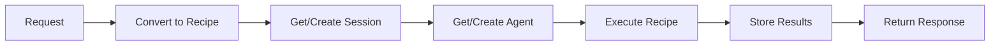

# Goose System Unification Report

## Executive Summary

After deep analysis of the Goose codebase, I've identified that the current architecture contains **four distinct execution systems** that all fundamentally do the same thing: run an AI agent to complete tasks. These systems have evolved independently, leading to significant code duplication and architectural complexity. This report proposes a **unified architecture** where a single goose server manages agents on a per-session basis, treating all execution types (interactive, scheduled, dynamic tasks, sub-recipes) as variations of the same core pattern.

## Current State Analysis

### Four Parallel Systems

1. **Main Interactive Agent** (goose-server)
   - Single shared Agent instance for all sessions
   - Concurrent session handling via Mutex-protected state
   - Extensions loaded once, shared across users
   - Streaming responses for real-time interaction

2. **Scheduled Recipe System** (Scheduler)
   - Creates fresh Agent per job execution
   - Full agent lifecycle management
   - Recipe-based configuration
   - Autonomous background execution

3. **Dynamic Task System**
   - Creates SubAgent instances on demand
   - Text-based instructions
   - Synchronous execution with result return
   - Extension inheritance from parent

4. **Sub-Recipe System**
   - Two execution paths: CLI spawning or SubAgent
   - Parameter validation and passing
   - Recipe-based with structured inputs
   - Task storage via TasksManager

### Key Problems Identified

#### 1. Code Duplication
- **Agent creation logic** repeated in 4+ places
- **Extension loading** implemented differently in each system
- **Provider configuration** duplicated across systems
- **Session management** inconsistent between systems
- **Recipe execution** patterns repeated

#### 2. Architectural Issues
- **Concurrency problems** in shared agent model (see AGENT_SESSION_REPORT.md)
- **Resource inefficiency** from creating agents ad-hoc
- **Inconsistent behavior** between execution modes
- **Complex debugging** due to multiple code paths
- **Maintenance burden** from parallel systems

#### 3. User Experience Issues
- Different capabilities in different contexts
- Unpredictable resource usage
- Difficult to reason about system behavior
- Limited multi-user support

## Proposed Unified Architecture

### Core Principle: One Agent Per Session

Instead of mixing shared and per-task agents, adopt a consistent model:

```
Every session gets its own Agent instance
Every task is executed within a session context
Every execution follows the same pipeline
```

### Unified Execution Pipeline



### Key Components

#### 1. AgentManager
Centralized agent lifecycle management:

```rust
struct AgentManager {
    sessions: HashMap<SessionId, SessionAgent>,
    pool: AgentPool,
    config: AgentConfig,
}

struct SessionAgent {
    agent: Arc<Agent>,
    session_id: SessionId,
    created_at: DateTime<Utc>,
    last_used: DateTime<Utc>,
    execution_mode: ExecutionMode,
}
```

#### 2. Universal Recipe Representation

All tasks become recipes internally:

```rust
enum RecipeSource {
    File(PathBuf),           // Traditional recipe file
    Inline(Recipe),          // Programmatically created
    Text(String),            // Dynamic task (converted to recipe)
    Reference(String),       // Sub-recipe reference
}

impl From<String> for Recipe {
    fn from(text: String) -> Self {
        Recipe::minimal(text)  // Creates recipe with just instructions
    }
}
```

#### 3. Execution Modes

Different behaviors, same infrastructure:

```rust
enum ExecutionMode {
    Interactive {
        streaming: bool,
        confirmations: bool,
    },
    Background {
        scheduled: Option<Schedule>,
        retry: Option<RetryConfig>,
    },
    SubTask {
        parent: SessionId,
        inherit: InheritConfig,
    },
}
```

#### 4. Session-Based Architecture

Every execution has a session:

```rust
struct Session {
    id: SessionId,
    agent: Arc<Agent>,
    messages: Conversation,
    metadata: SessionMetadata,
    mode: ExecutionMode,
}
```

### Implementation Strategy

#### Phase 1: Create Unified Interfaces (Week 1-2)

1. Define `AgentExecutor` trait
2. Create `RecipeConverter` for all task types
3. Implement `SessionManager` interface
4. Add compatibility adapters for existing code

**Deliverables:**
- New trait definitions
- Adapter implementations
- Unit tests for converters

#### Phase 2: Build AgentManager (Week 3-4)

1. Implement centralized agent management
2. Add session-agent mapping
3. Create agent pooling logic
4. Implement lifecycle management

**Deliverables:**
- AgentManager implementation
- Agent pool with limits
- Cleanup and recycling logic

#### Phase 3: Unify Task Systems (Week 5-6)

1. Convert dynamic tasks to inline recipes
2. Merge SubAgent functionality into main Agent
3. Standardize task execution paths
4. Update TasksManager for unified model

**Deliverables:**
- Unified task execution
- Migrated dynamic tasks
- Updated sub-recipe handling

#### Phase 4: Migrate Scheduler (Week 7-8)

1. Update scheduler to use AgentManager
2. Convert scheduled jobs to session-based model
3. Implement background execution mode
4. Maintain backward compatibility

**Deliverables:**
- Updated scheduler
- Session-based job execution
- Migration guide

#### Phase 5: Update goose-server (Week 9-10)

1. Replace shared agent with AgentManager
2. Implement per-session agents
3. Update API endpoints
4. Add multi-user support

**Deliverables:**
- Updated server architecture
- Per-session isolation
- Multi-user capabilities

#### Phase 6: Cleanup and Optimization (Week 11-12)

1. Remove deprecated code paths
2. Optimize agent creation and caching
3. Add monitoring and metrics
4. Update documentation

**Deliverables:**
- Cleaned codebase
- Performance improvements
- Complete documentation

## Benefits of Unification

### Technical Benefits

1. **Code Reduction**: ~30-40% less code to maintain
2. **Better Isolation**: Complete session isolation
3. **Resource Efficiency**: Agent pooling and reuse
4. **Consistent Behavior**: One execution model
5. **Easier Testing**: Single code path to test
6. **Better Debugging**: Unified logging and tracing

### User Benefits

1. **Multi-User Support**: True session isolation
2. **Predictable Performance**: Resource pooling
3. **Consistent Features**: Same capabilities everywhere
4. **Better Reliability**: Simplified architecture
5. **Enhanced Security**: Session-based isolation

### Developer Benefits

1. **Simpler Mental Model**: One way to do things
2. **Easier Onboarding**: Less to learn
3. **Faster Development**: Reusable components
4. **Better Maintainability**: Less duplication

## Migration Considerations

### Backward Compatibility

- Maintain existing APIs during transition
- Provide adapter layers for current interfaces
- Gradual deprecation with clear timeline
- Comprehensive migration guides

### Risk Mitigation

1. **Memory Usage**: Implement agent limits and pooling
2. **Performance**: Pre-warm agents, lazy loading
3. **Complexity**: Phased rollout with feature flags
4. **Testing**: Extensive integration tests at each phase

### Success Metrics

- Code coverage maintained above 80%
- No performance regression in benchmarks
- Zero breaking changes for existing users
- Reduced memory usage per session
- Improved request latency

## Detailed Design Specifications

### AgentManager API

```rust
impl AgentManager {
    /// Get or create an agent for a session
    pub async fn get_agent(&self, session_id: SessionId) -> Result<Arc<Agent>>;
    
    /// Execute a recipe in a session context
    pub async fn execute(&self, 
        session_id: SessionId, 
        recipe: Recipe,
        mode: ExecutionMode
    ) -> Result<ExecutionResult>;
    
    /// Clean up idle agents
    pub async fn cleanup_idle(&self, max_idle: Duration);
    
    /// Get session statistics
    pub async fn stats(&self) -> ManagerStats;
}
```

### Recipe Conversion API

```rust
trait IntoRecipe {
    fn into_recipe(self) -> Result<Recipe>;
}

impl IntoRecipe for String { /* text to recipe */ }
impl IntoRecipe for SubRecipe { /* sub-recipe to recipe */ }
impl IntoRecipe for ScheduledJob { /* job to recipe */ }
```

### Session Lifecycle

```rust
enum SessionState {
    Active,
    Idle(Duration),
    Executing(TaskId),
    Completed,
    Failed(Error),
}

impl Session {
    pub async fn execute(&mut self, recipe: Recipe) -> Result<()>;
    pub async fn checkpoint(&self) -> Result<()>;
    pub async fn restore(id: SessionId) -> Result<Self>;
}
```

## Alternative Approaches Considered

### 1. Keep Current Architecture
**Pros:** No migration needed
**Cons:** Perpetuates all current problems
**Decision:** Rejected - technical debt too high

### 2. Microservices Architecture
**Pros:** Complete isolation, scalability
**Cons:** Complexity, operational overhead
**Decision:** Rejected - over-engineering for current needs

### 3. Actor Model (e.g., using Actix)
**Pros:** Natural concurrency, message passing
**Cons:** Major rewrite, learning curve
**Decision:** Consider for future if scale demands

## Recommendations

### Immediate Actions (This Sprint)

1. **Create RFC**: Document the unified architecture proposal
2. **Prototype AgentManager**: Build proof-of-concept
3. **Benchmark Current System**: Establish performance baseline
4. **Identify Dependencies**: Map all code touching agents

### Short Term (Next Quarter)

1. **Phase 1-3 Implementation**: Unified interfaces and task system
2. **Testing Infrastructure**: Comprehensive test suite
3. **Documentation**: Architecture guides and migration docs
4. **Community Feedback**: RFC review and iteration

### Long Term (Next 6 Months)

1. **Complete Migration**: All phases implemented
2. **Deprecate Old Systems**: Remove legacy code
3. **Performance Optimization**: Tune the unified system
4. **Feature Parity**: Ensure no capability regression

## Conclusion

The current Goose architecture has evolved organically into four parallel systems that solve the same problem in different ways. This has led to significant technical debt, maintenance burden, and architectural limitations that prevent proper multi-user support and system scaling.

The proposed unified architecture addresses these issues by:
1. **Standardizing on one agent per session**
2. **Treating all tasks as recipes**
3. **Using a single execution pipeline**
4. **Centralizing agent lifecycle management**

This unification will reduce code complexity by 30-40%, improve system reliability, enable true multi-user support, and provide a solid foundation for future growth. The phased implementation approach minimizes risk while delivering incremental value.

The investment required (approximately 12 weeks of focused development) will pay dividends in reduced maintenance, improved user experience, and accelerated future feature development. I strongly recommend proceeding with this architectural unification as a high-priority initiative.

## Appendix: Code Examples

### Example 1: Current vs Unified Dynamic Task Execution

**Current:**
```rust
// Multiple code paths for dynamic tasks
let subagent = SubAgent::new(task_config).await?;
let result = subagent.reply_subagent(instruction, task_config).await?;
```

**Unified:**
```rust
// Single execution path
let recipe = Recipe::from(instruction);
let result = agent_manager.execute(session_id, recipe, ExecutionMode::SubTask).await?;
```

### Example 2: Current vs Unified Scheduled Job

**Current:**
```rust
// Ad-hoc agent creation in scheduler
let agent = Agent::new();
agent.add_extension(extension).await?;
agent.update_provider(provider).await?;
let stream = agent.reply(conversation, session_config, None).await?;
```

**Unified:**
```rust
// Managed agent with session
let recipe = Recipe::from_file(job.source)?;
let result = agent_manager.execute(
    session_id, 
    recipe, 
    ExecutionMode::Background { scheduled: Some(job.schedule), retry: None }
).await?;
```

### Example 3: Session Management

**Unified Approach:**
```rust
// All execution types use sessions
let session = agent_manager.get_or_create_session(
    SessionConfig {
        id: generate_id(),
        mode: ExecutionMode::Interactive { streaming: true, confirmations: true },
        parent: None,
    }
).await?;

// Execute any type of task in session context
session.execute(recipe).await?;

// Session automatically persisted
session.checkpoint().await?;
```

This unified approach dramatically simplifies the mental model while providing better isolation, resource management, and consistency across all execution contexts.
