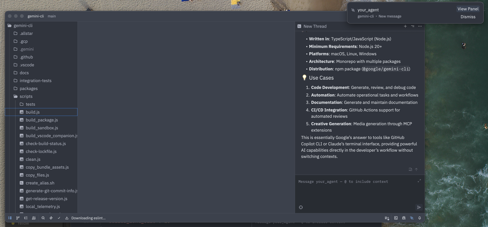

# Agent Client Protocol: Connecting Goose to Next-Gen Editors and Clients

Agent Client Protocol (ACP) is an emerging spec started by the Zed editor: https://agentclientprotocol.com/overview/introduction

This lets and clients (especially editors) work with any compatible agent that implements the ACP.
This makes things easier for implementers of agents, and implementers of clients (especially editors which can be quite fiddly).

<!--truncate-->

## Goose Support

Goose now supports acp currently via the `goose acp` subcommand.

This means you can use it in editors like Zed natively:




## Getting Started with Zed

To use with zed, the configuration should look like this:

```
{
  "agent_servers": {
    "Goose 🪿": {
      "command": "goose",
      "args": ["acp"],
      "env": {}
    }
  },
  "ui_font_size": 16,
  "buffer_font_size": 16
}
```

You can then open the agent sizebar, and start a new discussion thread with goose.

## Next up

We are interested in ACP as a general protocol for connecting clients of all kinds (desktop, editors, web, cli) to agents like goose, adopting it as a new standard even for goose to goose type interaction. Watch this space!


<head>
  <meta property="og:title" content="Agent Client Protocol: Connecting Goose to Next-Gen Editors and Clients" />
  <meta property="og:type" content="article" />
  <meta property="og:url" content="https://block.github.io/goose/blog/2025/09/22/agent-client-protocol-next-gen-editors" />
  <meta property="og:description" content="Introducing Goose's support for Agent Client Protocol (ACP), enabling seamless integration with modern editors and development tools." />
  <meta property="og:image" content="http://block.github.io/goose/assets/images/acp-support-cover.png" />
  <meta name="twitter:card" content="summary_large_image" />
  <meta property="twitter:domain" content="block.github.io/goose" />
  <meta name="twitter:title" content="Agent Client Protocol: Connecting Goose to Next-Gen Editors and Clients" />
  <meta name="twitter:description" content="Introducing Goose's support for Agent Client Protocol (ACP), enabling seamless integration with modern editors and development tools." />
  <meta name="twitter:image" content="http://block.github.io/goose/assets/images/acp-support-cover.png" />
</head>
