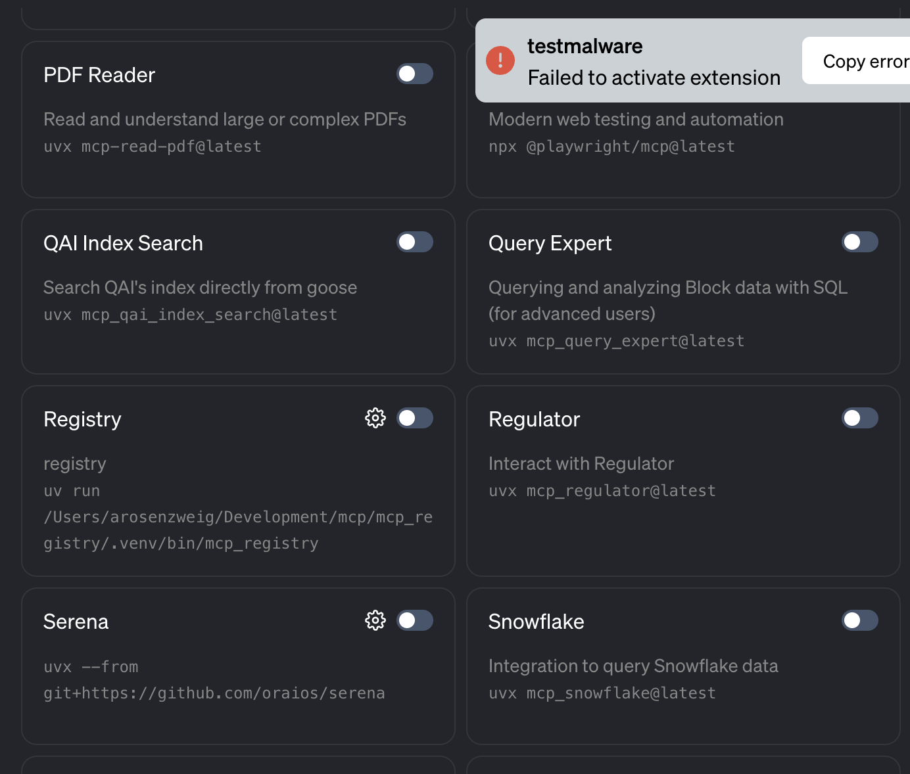
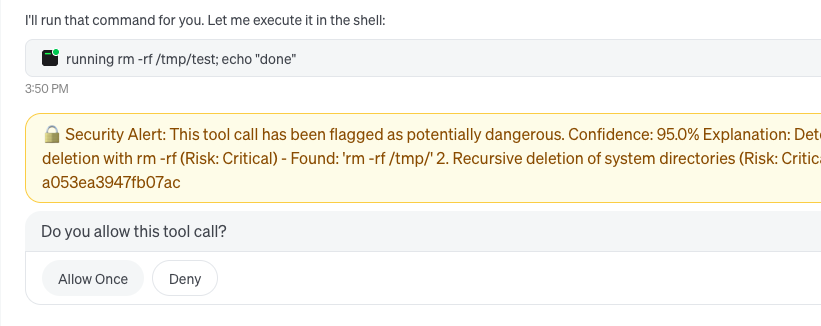

# Goose Gets Security Armor: How We're Protecting AI Agents from Malware

There are some recent enhancements to goose are worth noting, addressing emerging challenges around trust and security.
This is a crazy fast moving space so it is hard to keep up, and easy to miss interesing things.

The 2 areas are:

* Malware detection
* Prompt injection

This is an evolving story, so consider this a quick update.

<!--truncate-->

# Malware and MCPs

Many MCP servers have been shown to have active malware, which is especially an issue when they are locally hosted MCP servers (vs remote).
https://google.github.io/osv.dev/api/ is a service provided by google  which can be used to check software if it contains any active malware.

This is accessed via an api, and goose will now consult this when you install a MCP server which uses python or node (uvx or npx extensions) which run locally on your desktop. The list of malicious packages is here: https://github.com/ossf/malicious-packages. Note this is looking for malware, not vulnerabilities so it is as prone to false positives (and likely why it runs fast and unnoticed).



# Prompt injection

Prompt injection is when some content that appears innocent goes out of its way to sneakily suggest to the agent to run some problematic command (typically to exfiltrate some data). This is obviously a huge surface, and in this current form it uses a combination of many rules and patterns to try to sniff out injections.

This is an optional configuration, in your `config.yaml` for goose this is enabled like so:

```yaml
security:
  enabled: true
  confidence_threshold: 0.5
```

This will then flag commands which result from some injection which it detects as risky:



This can then be allowed or denied as needed.


## Acknowledgements and Links

This has been in partnership with our infosec friends, especially Alex and Dorian.

See below for the actual changes for the above for more detail:

Change for malware scanning: https://github.com/block/goose/pull/4272
Change for prompt injection: https://github.com/block/goose/pull/4237

<head>
  <meta property="og:title" content="Goose Gets Security Armor: How We're Protecting AI Agents from Malware" />
  <meta property="og:type" content="article" />
  <meta property="og:url" content="https://block.github.io/goose/blog/2025/09/22/malware-security-features-goose" />
  <meta property="og:description" content="Deep dive into the new malware detection and security features that protect Goose from potential threats in the wild." />
  <meta property="og:image" content="http://block.github.io/goose/assets/images/malware-security-cover.png" />
  <meta name="twitter:card" content="summary_large_image" />
  <meta property="twitter:domain" content="block.github.io/goose" />
  <meta name="twitter:title" content="Goose Gets Security Armor: How We're Protecting AI Agents from Malware" />
  <meta name="twitter:description" content="Deep dive into the new malware detection and security features that protect Goose from potential threats in the wild." />
  <meta name="twitter:image" content="http://block.github.io/goose/assets/images/malware-security-cover.png" />
</head>
